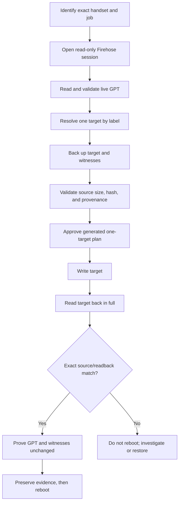

# Safe EDL Write Transaction

Use this model only after completing and independently verifying the
[recovery backup](README.md). It describes how to turn a necessary EDL write
into a narrow, auditable transaction. It is not a universal flasher and does
not supply a programmer, partition image, LUN, sector range, or device-specific
script.

The historical project scripts were useful because they treated a write as a
chain of proofs. A successful tool exit was never enough.

## 1. Define one job

Write down the fault and the smallest partition set that could repair it. A
job such as "restore this handset's own `modem_a` and `modem_b`" is bounded.
"Repair radio" is not.

Create a private case record containing:

- device model and variant observed from the live phone;
- private device serial used for selection;
- current firmware/ROM and active slot;
- intended target label or labels;
- source-image origin, byte size, and SHA-256;
- known-good programmer origin and SHA-256;
- rollback images and their verified hashes; and
- the expected post-write test.

Never reuse another case's serial, COM port, slot, programmer assumption,
partition coordinates, or secure/calibration image.

## 2. Establish a read-only session

Before generating a write plan:

1. Close programs that can contend for the USB interface.
2. Confirm the handset is in Qualcomm 9008 mode.
3. Require exactly one intended 9008 device. A remembered COM number is not
   device identity.
4. Select UFS storage and the already verified compatible programmer.
5. Open QFIL Partition Manager and require a complete live partition list.
6. Save the current partition map and session log in a new timestamped case
   directory.

If the table cannot be read cleanly, stop. A write is not a diagnostic for a
failed Firehose session.

## 3. Validate the live partition map

Resolve targets from the live GPT, not a screenshot or old script. A robust
validator should check at least:

- GPT signature and header size;
- logical block size used by the session;
- current and backup header locations;
- header CRC after zeroing the CRC field;
- partition-entry count and entry size;
- partition-entry-array CRC;
- each partition's first and last LBA;
- target extent within the usable LBA range;
- unique target-label match; and
- computed bytes equal `(last_lba - first_lba + 1) * block_size`.

Stop on a duplicate label, malformed GPT, CRC failure, impossible extent, or
size disagreement. Do not replace a failed live-map check with historical
sector numbers.

## 4. Capture the pre-write evidence set

Read the complete target immediately before the write. Record its exact byte
count and SHA-256. Also capture witnesses appropriate to the risk:

- the GPT header and partition-entry array for the target LUN;
- the backup GPT structures where accessible;
- the other slot copy when the target is slot-specific; and
- sensitive neighboring or functionally related partitions that must remain
  unchanged.

For a narrow modem-firmware repair, for example, unrelated identity/NV and
calibration areas are witnesses, not extra write targets. For a calibration
repair, the GPT and unrelated radio state can serve as witnesses.

Keep all reads private. Partition contents and logs may expose identifiers,
keys, calibration, account data, or user data.

## 5. Gate the source image

Require all of these before approval:

- source provenance is documented;
- same-handset material is used whenever the partition is device-specific;
- source SHA-256 equals the approved case value;
- source byte count equals the live target byte count exactly;
- target label, LUN, first LBA, sector count, and computed bytes were derived
  from the current live map; and
- a verified rollback and independent recovery route exist.

A matching filename is not evidence. A hash identifies bytes, but it does not
make another handset's secure or identity image portable.

## 6. Generate a one-target plan

Generate the write description from the validated live values. Inspect it as
data before sending it to Firehose. The plan must contain exactly one intended
target extent and the approved source file.

Reject the plan if it:

- contains more program operations than expected;
- refers to a different LUN, label, start LBA, count, or byte size;
- uses a relative or ambiguous source path;
- includes erase operations not explicitly required; or
- touches GPT, boot chain, EFS/NV, calibration, or userdata outside the stated
  job.

Use an explicit confirmation phrase that names the target and source hash.
The confirmation should occur only after the plan and backups exist.

## 7. Treat tool output as evidence

During the write, preserve complete stdout/stderr and the QFIL log. A safe
wrapper should fail if it sees a target error, short transfer, unrecognized
XML operation, or missing successful-completion marker—even when the process
exit code is zero.

Do not disconnect, reset, close QFIL, or allow the PC to sleep while the
transaction is active.

## 8. Read back before reboot

After the write:

1. Read the complete same target again into a new file.
2. Require exact expected byte count.
3. Calculate SHA-256 independently.
4. Require the readback hash to equal the approved source hash.
5. Re-read the GPT structures and witnesses.
6. Require every item outside the approved target to retain its pre-write
   hash.
7. Store the plan, source identity, pre-write hash, post-write hash, witness
   results, and logs together.

Only then reset or reboot the handset.

## Failure rules

| Failure | Required response |
|---|---|
| Programmer or live GPT cannot be verified | Stop without writing. |
| Target label is missing or ambiguous | Stop; do not use remembered sectors. |
| Source size or hash differs | Stop and reacquire the approved input. |
| Backup is short or unreadable | Stop; no rollback proof exists. |
| Write reports an error or incomplete transfer | Do not reboot. Preserve logs and re-establish read access. |
| Full readback differs from the source | Do not reboot. Investigate the session and restore only from a verified rollback when safe. |
| GPT or witness changed unexpectedly | Do not reboot. Treat this as a widened write or storage-integrity incident. |
| Android boots but the fault remains | Collect new evidence; do not expand the write set by guesswork. |

## Public-release boundary

Publish the method, validators, placeholder schemas, and synthetic tests. Keep
case records, programmer binaries, rawprogram files generated from a live
phone, partition maps, source/readback images, private logs, serials, and
secure-state evidence out of Git.

The corresponding design findings are documented in
[EDL recovery automation findings](../../Research/08-EDL-Recovery-Automation.md).
